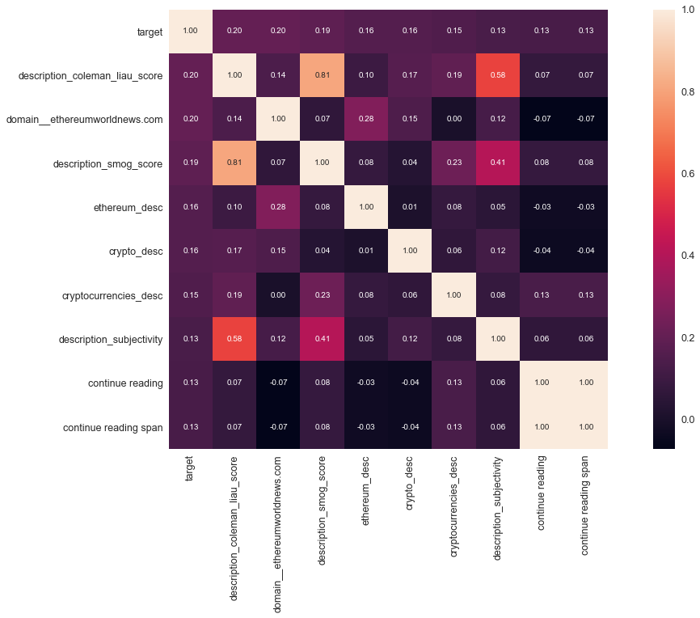
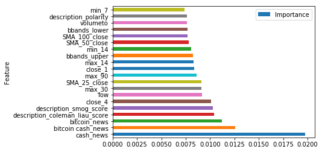

# Report Writeup + Technical Analysis

#### DJ Porter     | DSI-4-SEA | July 15, 2018

## How will the users 'view' an article based on just title and description?

###  Can I predict how an audience will perceive an article?

Cryptocurrency is still in its infancy. Deemed by many as a 'wild west'. I believe that the majority of news that is published is hype and therefore many trading decisions are made due to hype and emotional reasons. I plan to demonstrate that some articles have more "weight" to the community as a whole.

### General Overview

#### Articles

I chose to build a list of articles from the site [Cryptopanic.com](cryptopanic.com). This site aggregates news, opinions and posts from around the web that pertain to cryptocurrencies and blockchain technologies. The site sorts them by the coin or coins that the article is related to and allows the users to vote on how they perceive the article.

CryptoPanic aggregates posts and article from various sources like, Reddit, Twitter, bitcoin.com, ccn.com, coindesk.com, ethereumworldnews.com, dailyhodl.com, wsj.com and many others.

CryptoPanic also supports languages in these regions: en (English), de (Deutsch), es (Español), it (Italiano), pt (Português), ru (Русский):

CryptoPanic also allows users to track their crytpo related portfolios on the site.

CryptoPanic has 8 options for voting that demonstrate a sentiment for the article. The voting options are:
`like` | `dislike` | `bullish` | `bearish` | `important` | `lol` | `toxic` | `saved`. 

Limitations.
- Cryptopanic does not offer the full text of the article in the API. Therefore all analyis will be completed using the title, description and voting information.
- I was able to collect 563 individual articles for Bitcoin (BTC) within the date ranges of `2018-04-08` through `2018-07-09`.

### Assumptions associated with the voting options

I am making the assumption that article will reach a level of 'maturity' after about a week of being on the site. New articles would have made it to the site and the older ones will likely be ignored and assumed to not be relevant by users. The votes that the article has accumulated will likely not change. 

`like` = The user liked that the article (this assumes that the article is written well and may or may not effect any other features)

`dislike` = The user did not like the article (this assumes that the article is written well and may or may not effect any other features)

`bullish` = The user deems that the article to have a bullish impact on the price of the associated currency.

`bearish` = The user deems that the article to have a bearish impact on the price of the associated currency.

`important` = The user deems that the article is important in some way.

`lol` = The user found this article amusing in some way.

`toxic` = The user found this article to be misleading or contain bad information; `SPAM ` filter. It should be noted that only paying pro members can vote for an article to be toxic.

`saved` = The user saved the article to view later; A bookmark.

### Price data

#### Collecting 
I collected price data from the [CryptoCompare.com](CryptoCompare.com) API.

Pricing data is available in daily, hourly and minutely increments. The minute data is only stored for 7 days and for the scope of this project I felt it was too granular. The daily data would have probably been sufficient however, articles are posted quite often and may have a near immediate effect on price. for this reason I chose to collect hourly data.

##### Transforming

Like any asset price is not the only factor. Usually investors will monitor technical indicators in making trading decisions.

I added various indicators using a library called [TA-lib](https://github.com/mrjbq7/ta-lib), available on Github. TA-lib includes 200 indicators such as ADX, MACD, RSI, Stochastic, Bollinger Bands etc... and 
candlestick pattern recognition

I picked a few of the most popular indicators to add the the pricing dataframes.

I then created predictor columns from the pricing data using `.diff()`, `.pct_change()` and `.shift()` from the pandas library.

### Assumptions associated with pricing data.

Many articles are made in response to either price, and indicator value or an event associated with the coin. The events sometimes come directly from the development group, however other times the event is associated with a problem connected to the coin. In recent times article are in response to a federal authority regulation interest or a hack of an exchange where cryptocurrencies are bought and sold.

Traders respond to technical indicators and news associated with an asset. Therefore I will create columns to reflect indicator values associated with a given coin.
- RSI (Relative Strength Index) (standard periods, 14 )
- SMA (Simple Moving Average) 9, 25, 50, 100 period 
- Bollinger Bands (standard periods)
- Stochastic Strength Indicator (standard periods)
- ADX Average Daily Direction (standard periods, 14)
- ATR Average True Range (standard periods, 14)
- OBV Observed Buy Volume
- MACD Moving Average Convergence Divergence
- MFI Money Flow Index
- Min Max (Minimum and Maximum price over the last __n__ days
    - 365 day
    - 180 day
    - 90 day
    - 30 day
    - 14 day
    - 7 day
- HT_TRENDMODE - Hilbert Transform - Trend vs Cycle Mode

## Approach

- Define an article as `"mature"` when it is a week old. Therefore only use article that have reached maturity in the dataset.
- Define that an article can only have a level of bullishness vs bearishness. Therefore engineer a feature to display bullishness vs bearishness in terms of percent.
- Define that all other user voting columns are numerical and will have values from `0 to infinity`.

Use TF-IDf to collect a corpus of words from the titles and descriptions of the articles.
- remove stop English stop words
- set maximum features to 2000 per title and description
- set a min amount of times that the word must appear in a corpus to 10% total
- set **n** grams to a range of `(1, -3)`

Build columns that measure the readability of the article using two readability scoring methods. My assumption here is that users will quickly assume the reliability of the article if they can consume it and understand it quickly. More info related to these methods is below.

- Smog Index
    - (https://en.wikipedia.org/wiki/SMOG)
- Coleman Liau Index
    - (https://en.wikipedia.org/wiki/Coleman%E2%80%93Liau_index)
    
Use [textblob](https://textblob.readthedocs.io/en/dev/) to build features for checking polarity and subjectivity of the title and description.
- polarity has a range of `(-1, 1)`
- subjectivity has a range of `(0, 1)`

Create 1-hot-encode for all domains and authors

Add dummy columns to represent date specific variables
- Day of week `(0-6)` 
- is day a business day `(1,0)`
    - code adapted from [jckantor/NYSE_tradingdays.py](https://gist.github.com/jckantor/d100a028027c5a6b8340)
- time of day `(0-23)`

### Predictions

- is Bullish values are `>= 65`
- is Bearish values are `<= 35`
   - otherwise neutral 
- important (continuous)
- is the article toxic `(1,0)`
- is liked `(1,0)`
- is disliked 
- will the article have an impact on price in the next:
    - 1 hr
    - 4 hrs
    - 12 hrs
    - 24 hours

## EDA

During the period that the articles where pulled from the `BTC/USD` trading pair chart looks like this. The trading Pair has been in a downward decline since mid January of this year.

# Distribution of votes 

Refer to [this](DistPlots.ipynb) notebook for the distribution of the votes.

## Simple Correlation Check against ***Bullish*** votes

The correlation heat map shows minor correlation to bullishness associated with the Colmean Liau Index of the description and also the domain [ethereumworldnews.com](ethereumworldnews.com)

## Results

## Using the Elastic Net model to predict ***User Generated Sentiment***

The final results that predicted bullishness and bearishness where completed using an ElasticNetCV method. The models used a 0.5 regularization to gain optimal alphas.

The optimal alphas showed a rather hight MSE for bullishness and bearishness of 1222, and 1121 respectively.

Which shows incorrect values on average of 32 points.

Refer to [this](articleTesting.ipynb) notebook for the ElasticNet details.

Articles actual

Articles predicted

The model does relatively well with minimal tuning:
    Notice that this model conservative in its predictions, which is acceptable. 

# Predict on '***is_bullish***' using Random Forest Classifier

## Random Forest Classifier

Is the community going to label the article as bullish?

Precision show that when the Random Forest Classifier identified an article as Bullish it was Bullish 78.6% of the time.
Recall shows that of all of the bullish articles 88.0% where identified by the Random Forest Classifier.
Accuracy show that of all the articles the Random Forest Classifier predicted them to be bullish correctly 76.0% of the time.

# The most important features in predicting how the community will vote on bullish.

### The words Bitcoin and Bitcoin cash are coming from words used in the title or description of the article.
- This is expected because the articles are about Bitcoin. Bitcoin Cash is also another coin that was forked from the original Bitcoin. 

### Many other features refer to price history and activity at the time of the article. 
- `close_1` `close_4` refers to the price n hours ago.
- `min_7`, `min_14` refers to the minimum price Bitcoin has reached in the last n days.
- `max_30`, `max_90` refers to the maximum price Bitcoin has reached in the last n days.
- `SMA_25_close`, ` SMA_50_close`, `SMA_100_close` refers to the Simple Moving Average on the close price over a period of n days.
    
    - All other features refer to other price history details.
    
    
- `coleman_liau_score`, `smog_score` refer to readability of the article.

    -This is expected because people are preceptive and they can determine if an article is worth reading quickly.

### Looking Forward and Next Steps

- Reproduce from a different timeframe.
- Collect more data. The short timeframe of about 4 months may not accurately represent data from the Crypto community.
- Collect the article body to get a more complete picture of what the article is saying.
- Collect incremental snapshots of the article votes. The votes where collected at random times. To get a more accurate representation of users interest in the article.
- Do this on a GPU. My MacBook Pro is not handling this very well.
